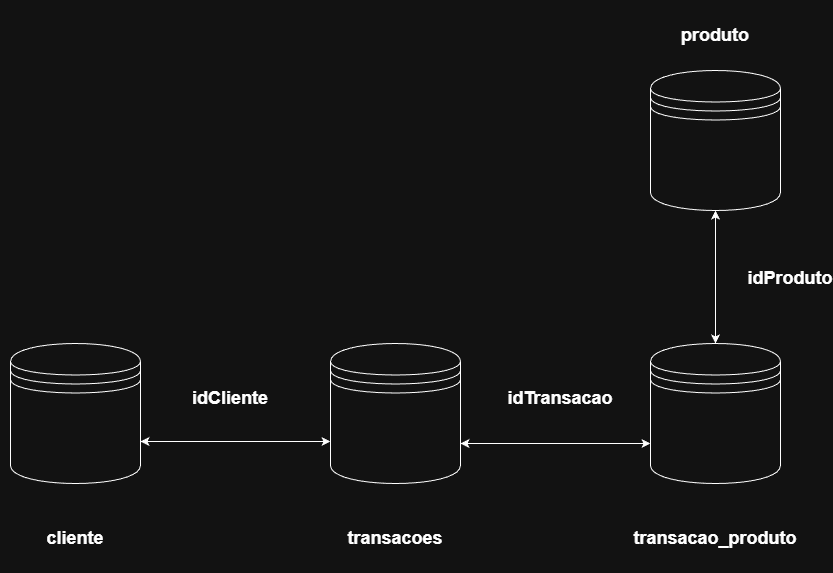
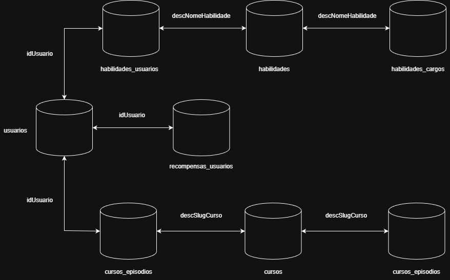
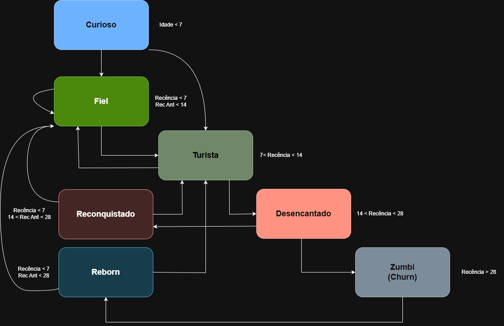
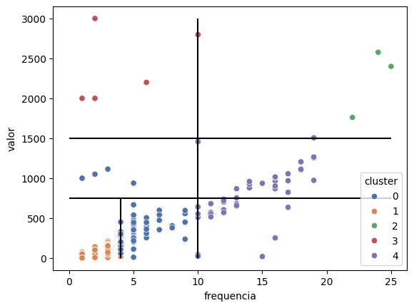
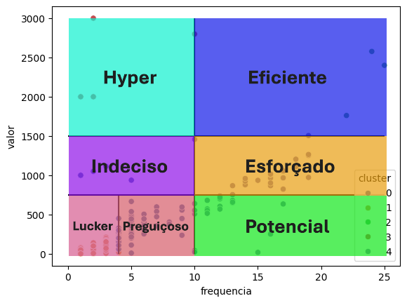

# 🎯 Loyalty Predict – Canal TeoMeWhy

## 🏢 Contexto do Negócio
O canal TeoMeWhy utiliza um sistema de pontos para gamificação e recompensas. Os clientes acumulam pontos de duas formas principais:
1. **Participação em Lives:** Pontos são concedidos por presença e interação nas transmissões da Twitch.
2. **Plataforma de Cursos:** Clientes ganham pontos ao vincular sua conta Twitch e adquirir ou consumir cursos.

Os dados brutos de clientes e transações originam-se dessas duas fontes. Compreender quais perfis de usuários apresentam maior chance de retorno é crucial para:
- Direcionar campanhas de marketing de forma mais eficiente
- Oferecer benefícios e comunicações personalizadas
- Otimizar o sistema de recompensas para maximizar o engajamento

---

## ❓ Problema de Negócio
O projeto busca responder às seguintes perguntas-chave:
- **Quem?** Quais clientes têm maior probabilidade de se tornarem fiéis?
- **O quê?** O que está acontecendo com o engajamento dos clientes atuais?
- **Quanto?** Quais são as métricas gerais e como evoluem?
- **Como?** Como podemos melhorar essas métricas e incentivar a fidelização?

---

## 🎯 Ações do Projeto
- **Análise de Métricas:** Cálculo e interpretação de DAU, MAU e outras métricas de engajamento
- **Definição do Ciclo de Vida:** Segmentação dos usuários (novos, ativos, em risco, inativos)
- **Análise de Agrupamento:** Identificação de perfis com comportamentos semelhantes
- **Modelagem Preditiva:** Desenvolvimento de modelo ML para classificar potencial de fidelidade
- **Recomendação de Incentivos:** Proposição de estratégias baseadas nos perfis e previsões

---

## 📂 Dataset
- [TeoMeWhy Loyalty System](https://www.kaggle.com/datasets/teocalvo/teomewhy-loyalty-system/code)
  
<p align="center">
  
</p>

- [TeoMeWhy Education Platform](kaggle.com/datasets/teocalvo/teomewhy-education-platform)

<p align="center">
  
</p>

---

## 🛠 Tecnologias Utilizadas
- **Linguagem:** Python 3.x
- **Manipulação e Análise:** Pandas, NumPy
- **Visualização:** Matplotlib, Seaborn
- **Modelagem:** Scikit-learn (Regressão Logística, Random Forest), XGBoost
- **Banco de Dados:** SQL (SQLite)
- **Experimentação:** MLflow
- **Ambiente:** Jupyter Notebook

---

## 🔎 Metodologia

### 1. Métricas Gerais de Engajamento
- **DAU (Daily Active Users):** Usuários únicos que interagiram por dia
  - *Observação:* Dados mais antigos podem ter inconsistências pois o servidor era desligado após as lives
- **MAU (Monthly Active Users):** Calculado com janela de 28 dias (4 semanas)
  - *Insight:* Picos de atividade estão correlacionados com lançamentos de cursos

### 2. Ciclo de Vida e Segmentação dos Usuários

#### 2.1. Ciclo de Vida

<p align="center">
  
</p>

| Estágio | Descrição | Critério |
|---------|-----------|----------|
| **Curioso** | Novo cadastro | Primeiros 7 dias na base |
| **Fiel** | Engajamento nos ultimos dias | Recência <= 7 e Recência anterior <= 14 dias |
| **Turista** | Perda de engajamento | Recência > 7 dias e <= 14 dias |
| **Desencantado** | Risco de churn | Recência > 14 dias e <= 28 dias |
| **Zumbi** | Churn | Recência > 28 dias |
| **Reconquistado** | Engajamento após risco de churn | Recência <= 7 dias e Recência anterior > 14 e <= 28 dias |
| **Reborn** | Engajamento após churn | Recência <= 7 dias e Recência > 28 dias |


#### 2.2. Frequência x Valor

Clusterização:

<p align="center">
  
</p>

Segmentação aplicada:

<p align="center">
  
</p>

| Estágio | Descrição | Critério |
|---------|-----------|----------|
| **00 - Lucker** | Frequência baixa e pouca interação | Frequência < 5 e Valor < 750|
| **01 - Preguiçoso** | Frequência melhor que Lucker e pouca interação |Frequência <= 10 e Valor < 750|
| **11 - Preguiçoso** | Mais interação que os anteriores, com frequência baixa |Frequência <= 10 e Valor > 750 e < 1500|
| **11 - Hyper** | Mais interação que os anteriores, com frequência baixa |Frequência <= 10 e Valor > 1500 e < 3000|
| **20 - Potencial** | Alta frequência, mas pouca interação |Frequência < 10 e Valor < 750|
| **21 - Esforçado** | Alta frequência, interação mediana |Frequência < 10 e Valor > 750 e < 1500|
| **22 - Eficiente** | Alta frequência, alta interação |Frequência < 10 e Valor > 1500|

### 3. Análise Exploratória (EDA)
- Distribuição de frequência de compras/interações
- Análise do ticket médio e valor acumulado por usuário
- Identificação de padrões de retorno e sazonalidade

### 4. Engenharia de Atributos e Feature Stores
As variáveis preditivas foram organizadas em duas **feature stores** para garantir reprodutibilidade e consistência entre treino e produção.

#### 🗂️ Feature Store Transacional
*Features extraídas do sistema de fidelidade (Twitch):*

| Feature | Descrição |
|---------|-----------|
|`idadeDias`|Idade na base em dias|	
|`freqAtvVida`|Frequencia de ativação total|	
|`freqAtvD7`|Frequencia de ativação há 7 dias atrás|	
|`freqAtvD14`|Frequencia de ativação há 14 dias atrás|	
|`freqAtvD28`|Frequencia de ativação há 28 dias atrás|	
|`freqAtvD56`|Frequencia de ativação há 56 dias atrás|	
|`freqTransVida`|Frequência de transações total|	
|`freqTransD7`|Frequência de transações há 7 dias atrás|	
|`freqTransD14`|Frequência de transações há 14 dias atrás|	
|`freqTransD28`|Frequência de transações há 28 dias atrás|	
|`freqTransD56`|Frequência de transações há 56 dias atrás|	
|`saldo`|Saldo total|	
|`saldoD7`|Saldo há 7 dias atrás|	
|`saldoD14`|Saldo há 7 dias atrás|	
|`saldoD28`|Saldo há 7 dias atrás|	
|`saldoD56`|Saldo há 7 dias atrás|	
|`ptsPosVida`|Pontos positivos totais|	
|`ptsPosD7`|Pontos positivos há 7 dias atrás|	
|`ptsPosD14`|Pontos positivos há 14 dias atrás|	
|`ptsPosD28`|Pontos positivos há 28 dias atrás|	
|`ptsPosD56`|Pontos positivos há 56 dias atrás|	
|`ptsNegVida`|Pontos negativos totais|	
|`ptsNegD7`|Pontos negativos há 7 dias atrás|	
|`ptsNegD14`|Pontos negativos há 14 dias atrás|	
|`ptsNegD28`|Pontos negativos há 28 dias atrás|	
|`ptsNegD56`|Pontos negativos há 56 dias atrás|	
|`pctTransManha`|Porcentagem de transações pela manhã|	
|`pctTransTarde`|Porcentagem de transações pela tarde|	
|`pctTransNoite`|Porcentagem de transações pela noite|	
|`transDiaVida`|Frequência de Transações/Frequencia de Ativação total|	
|`transDiaD7`|Frequência de Transações/Frequencia de Ativação há 7 dias atrás|	
|`transDiaD14`|Frequência de Transações/Frequencia de Ativação há 14 dias atrás|	
|`transDiaD28`|Frequência de Transações/Frequencia de Ativação há 28 dias atrás|	
|`transDiaD56`|Frequência de Transações/Frequencia de Ativação há 56 dias atrás|	
|`pctAtvMAU`|Porcentagem de Ativação/MAU|	
|`qtdHorasVida`|Horas em live totais|	
|`qtdHorasD7`|Horas em live há 7 dias|	
|`qtdHorasD14`|Horas em live há 14 dias|	
|`qtdHorasD28`|Horas em live há 28 dias|	
|`qtdHorasD56`|Horas em live há 56 dias|	
|`avgIntervaloVida`|Média do intervalo de dias entre ativações|	
|`avgIntervaloD28`|Média do intervalo de dias entre ativações nos últimos 28 dias|	
|`pctChatMessage`|Porcentagem de Participação do produto alvo|	
|`pctAirFlowLover`|Porcentagem de Participação do produto alvo|	
|`pctRLover`|Porcentagem de Participação do produto alvo|	
|`pctResgatarPonei`|Porcentagem de Participação do produto alvo|	
|`pctListaPresenca`|Porcentagem de Participação do produto alvo|	
|`pctPresencaStreak`|Porcentagem de Participação do produto alvo|	
|`pctTrocaPontosStreamElements`|Porcentagem de Participação do produto alvo|	
|`pctReembolsoPontosStreamElements`|Porcentagem de Participação do produto alvo|	
|`pctRPG`|Porcentagem de Participação do produto alvo|	
|`pctChurnModel`|Porcentagem de Participação do produto alvo|

#### 🗂️ Feature Store Educacional
*Features extraídas da plataforma de cursos:*

| Feature | Descrição |
|---------|-----------|
|`qtdCursosCompletos`|Cursos completos|	
|`qtdCursosIncompletos`|Cursos incompletos|	
|`carreira`|Porcentagem de progresso no curso alvo|	
|`coletaDados2024`|Porcentagem de progresso no curso alvo|	
|`dataPlatform2025`|Porcentagem de progresso no curso alvo|	
|`dsDatabricks2024`|Porcentagem de progresso no curso alvo|	
|`dsPontos2024`|Porcentagem de progresso no curso alvo|	
|`estatistica2024`|Porcentagem de progresso no curso alvo|	
|`estatistica2025`|Porcentagem de progresso no curso alvo|	
|`github2024`|Porcentagem de progresso no curso alvo|	
|`github2025`|Porcentagem de progresso no curso alvo|	
|`go2026`|Porcentagem de progresso no curso alvo|	
|`iaCanal2025`|Porcentagem de progresso no curso alvo|	
|`lagoMago2024`|Porcentagem de progresso no curso alvo|	
|`loyaltyPredict2025`|Porcentagem de progresso no curso alvo|	
|`machineLearning2025`|Porcentagem de progresso no curso alvo|	
|`matchmakingTramparDeCasa2024`|Porcentagem de progresso no curso alvo|	
|`ml2024`|Porcentagem de progresso no curso alvo|	
|`mlflow2025`|Porcentagem de progresso no curso alvo|	
|`nekt2025`|Porcentagem de progresso no curso alvo|	
|`pandas2024`|Porcentagem de progresso no curso alvo|	
|`pandas2025`|Porcentagem de progresso no curso alvo|	
|`python2024`|Porcentagem de progresso no curso alvo|	
|`python2025`|Porcentagem de progresso no curso alvo|	
|`speedF1`|Porcentagem de progresso no curso alvo|	
|`sql2020`|Porcentagem de progresso no curso alvo|	
|`sql2025`|Porcentagem de progresso no curso alvo|	
|`streamlit2025`|Porcentagem de progresso no curso alvo|	
|`tramparLakehouse2024`|Porcentagem de progresso no curso alvo|	
|`tseAnalytics2024`|Porcentagem de progresso no curso alvo|	
|`diasUltAtv`|Quantidade de dias desde a ultima atividade|

#### 🔄 Atualização das Feature Stores
As feature stores são atualizadas através dos scripts em `src/features/` e versionadas por data, permitindo reprocessamento histórico e consistência nas modelagens.

### 5. Modelagem Preditiva
Foram testados diferentes algoritmos de classificação:
- **Regressão Logística:** Modelo baseline para interpretabilidade
- **Random Forest:** Para capturar relações não-lineares
- **XGBoost:** Modelo avançado baseado em gradient boosting

### 6. Avaliação do Modelo
Métricas analisadas:
- **Acurácia:** Proporção geral de acertos
- **Precisão:** Das previsões de "fiel", quantos realmente foram
- **Recall (Revocação):** Do total de fiéis, quantos o modelo identificou
- **AUC:** Capacidade de distinguir entre as classes

---

## 📊 Principais Insights
*(Espaço para adicionar os insights mais importantes da análise)*

- *Exemplo:* Usuários que participam de 3+ lives no primeiro mês têm 80% mais chance de se tornarem recorrentes
- *Exemplo:* A janela de 28 dias para MAU revela que engajamento é impulsionado por lançamentos de cursos

---

## 🤖 Performance do Modelo
| Modelo | Acurácia | Precisão | Recall | AUC |
| :--- | :--- | :--- | :--- | :--- |
| Regressão Logística | - | - | - | - |
| Random Forest | - | - | - | - |
| XGBoost | - | - | - | - |

---

## 💡 Recomendações de Negócio
- **Alta probabilidade de fidelidade (Top 20%):** Oferecer benefícios exclusivos e acesso antecipado a conteúdos
- **Probabilidade moderada:** Comunicações personalizadas com lembretes de lives e cursos relevantes
- **Em risco (baixa probabilidade):** Campanhas de reengajamento com incentivos de pontos em dobro

---

## 🚀 Próximos Passos
1. **Refinar Modelo:** Testar novas variáveis e otimizar hiperparâmetros do XGBoost
2. **Criar Dashboard:** Desenvolver dashboard interativo para acompanhamento das previsões
3. **Testes A/B:** Validar impacto das campanhas direcionadas pelo modelo
4. **Automatizar Pipeline:** Estruturar atualização automática das feature stores e previsões

---

## ▶️ Como Executar o Projeto

```bash
# 1. Clone o repositório
git clone https://github.com/DSDavidGon/loyalty-predict

# 2. Acesse a pasta do projeto
cd loyalty-predict

# 3. (Recomendado) Crie e ative um ambiente virtual
# python -m venv venv
# source venv/bin/activate  # No Windows: venv\Scripts\activate

# 4. Instale as dependências
pip install -r requirements.txt

# 5. Explore os notebooks ou execute os scripts

```
